# Area Surveilance and Monitoring using Autonomous Drone Systems

Saul Vassallo (88812L) and Nick Gaerty (413403L)

## Keywords

UAV - Unmanned Aerial Vehicle (Drones)

## Introduction

Our project specifically focuses on utilizing three UAVs for efficient and effective search and rescue missions. The primary objective is to interface with these drones to survey extensive areas and identify stationary objects, simulating a scenario where UAVs can locate and identify stranded vehicles in the aftermath of natural disasters or accidents. For our proof of concept, we selected cars as the stationary objects of interest.

For our project, we were given three DJI Mini 3 drones, which have advanced capabilities and suitability for precise aerial surveys. The project was divided into three core sections: pathfinding and route optimization, object detection, and drone communication and simulation. Each section addresses a fundamental aspect of the overall mission, ensuring a comprehensive and functional solution.

Ensuring effective pathfinding and route optimization to cover large areas thoroughly and as quickly as possible is a critical component of our project. For this, we used genetic algorithms and k-means clustering. By using these AI techniques, it is possible to ensure that the surveying process is carried out as effectively as possible.

The majority of search and rescue operations depend heavily on object detection, which is the subject of the second portion of our project. The system's ability to correctly identify cars from aerial imagery is the goal here. To do this, we trained the YOLOv5m model on a public online dataset [1].

## Literature Review

Over the past decade, autonomous unmanned aerial vehicles (UAVs) have been extensively researched. Numerous applications have been identified and discussed, including environmental and natural disaster monitoring, border security, emergency support, search and rescue operations, and relay communications [2-8]. As Yanmaz et al. [9] discussed, although these projects address different issues in various ways, they all follow a similar design structure, as illustrated in in _Fig 1_.

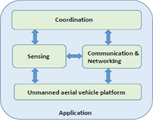

Yanmaz et al. [9] also discuss the concepts of centralized and decentralized communication systems. The overall design structure they describe is applicable to our project from a high-level abstract perspective.

The concept of object detection for drones and UAVs has been heavily researched in recent years. The challenges faced in vehicle detection in this context have been discussed extensively in past research papers. A few notable examples include _Real-Time Vehicle Detection from UAV Aerial Images Based on Improved YOLOv5_ [10] and _Real-Time Object Detection for an Unmanned Aerial Vehicle Using an FPGA-Based Vision System_ [11].

Tayara et al. [12] propose a solution to this problem using a Fully Convolutional Regression Network (FCRN) along with ground truth data.

During training, the FCRN is given the input image along with its corresponding ground truth, with the aim of minimizing the error between the ground truth and the predicted output. During the inference phase, thresholding is performed on the trained model, and a connected component algorithm is used to determine the count and location of the detected vehicles [12].

The FCRN has two paths: the down-sampling path and the up-sampling path. The down-sampling path is the pretrained VGG-16 network which consists of 3x3 padded repeated convolutions, a rectified linear unit and a max pooling operation. In the up-sampling path, skip connections are used to merge fine, shallow information with deep, coarse semantic information. This facilitates for accurate vehicle detection and localization [12].

Tayara et al.’s ground-truth preparations involve generating two-dimensional Gaussian functions based on the dataset’s annotations. The vehicles height, width and orientation are accounted for, which result in rotated ground-truth annotations.

As for their implementation, 224x224 random patches from aerial imagery were selected, ensuring that each patch contains at least one vehicle for training. Various data augmentation techniques such as rotation, flipping, and shifting were performed to increase the number of examples. For this training, the mean square error target function was used, with parameters updated using the RMSprop optimizer. An initial learning rate of 0.01 was applied, which decayed exponentially over 200 epochs, and the empirical threshold was set to 120.

Another implementation is by Li et al. [10], which uses the YOLOv5 algorithm for vehicle detection. It is stated that the default YOLOv5 parameters were used, along with an adaptive anchor strategy and mosaic data enhancement.

Regarding the dataset, Li et al. used the VisDrone2019-DET dataset and focused on four vehicle categories: car, van, truck, and bus. The original dataset was reduced to a subset of 3650 photos, which were randomly split with a ratio of 8:1:1, resulting in 2800 training set photos, a validation set of 350, and a test set of 500.

Li et al. preprocessed the data by applying adaptive image scaling and mosaic data enhancement. The adaptive scaling helped adjust for images with different aspect ratios to negate redundant information to look through. Mosaic data enhancement selects four original randomly scaled images which have been cropped and arranged, then proceeds to stitch them into a new image. This is done to boost the ability to detect small targets. These processes can be seen in _Fig 2_.

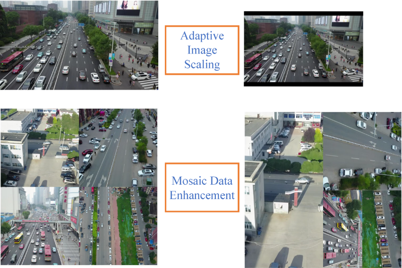

For the evaluation, Li et al. use AP (Average Precision) and mAP (mean Average Precision). These metrics are calculated based on precision (P), which indicates how many vehicles were predicted correctly, and recall (R), which shows the proportion of vehicles in a category that were correctly predicted. The terms TP, FP, and FN represent the number of true positives, false positives, and false negatives, respectively.

There are many papers discussing the challenges and potential solutions faced in the coordination block of drone applications, 2 such examples are _Networked UAVs as aerial sensor network for disaster management applications_ [13] and _On Path Planning Strategies for Networked Unmanned Aerial Vehicles_ [14].

In another article, Quaritsch et al. [13] discuss the use of multiple UAVs to map out an environment by capturing pictures at various locations, which are then utilized to create a mosaic of the surveyed area.

Quaritsch et al. achieve this by first translating the geographic coordinates of the surveyed area to relative coordinates around the home station. Next the area is partitioned into smaller subsections. The optimal placement of UAVs for picture collection is determined by formulating the problem as an ILP (integer linear programming) problem. Finally a route visiting each of the picture points is generated using a genetic algorithm.

Quaritsch et al. compare this approach to a naive approach and find that it is able to survey a larger total area. However, this comes at the cost of capturing more photos and visiting more picture points

In _On Path Planning Strategies for Networked Unmanned Aerial Vehicles_ [14], Yanmaz et al. break down path planning into 2 steps; area decomposition and routing, and compares 2 solutions.

### Static Area Decomposition and Simple Capacitated Vehicle Routing

Yanmaz et al. [14] break this process down into 2 main steps:

1. Dividing the area to be explored into smaller manageable sections.
2. Divisions are predetermined and do not change dynamically in response to real world conditions

This method assumes prior knowledge of the observation and forbidden areas, the algorithm is described below:

```
1. Partitioning:
// The observation area is divided into smaller subsections if needed

2. Picture Point Generation:
// Picture point coords are generated using an ILP as described in detail by Quaritsch et al [10]

3. K-Means Clustering:
// Picture points are clustered together so that each cluster can be visited by one drone within its max flight time

4. Routing:
// For each cluster the shortest route is generated using a genetic algorithm based Travelling Salesman Problem solution.
```

### Adaptive Routing with Area Decompositon

Yanmaz et al. [14] also discuss a probabilistic routing solution that assumes no prior knowledge of the area to be surveyed. This method does not utilize area decomposition but instead employs a belief-based movement approach. Although interesting, this method was deemed less relevant to our project.

## Project Design

As stated in the introduction, our project is split into 3 main sections, pathfinding and route optimization, object detection, and drone communication and simulation.

### Drone Communication and Simulation

The DJI Mini 3 drones facilitate communication and customisation through the DJI Mobile SDK [15]. The mobile SDK can be leveraged through either android studio or xcode to build a mobile application that interfaces with the drones. For our project we opted for an android application, we made this choice since developing an IOS app required both developers to have macbooks which was not the case.

DJI provide free sample code and documentation explaining how to integrate the sample project into an android app using android studio, however, when following the steps outlined in the tutorial the code fails to compile and build. This is most likely due to the sample code using various deprecated packages and being created to run on an outdated version of android studio.

DJI also provide tutorials of how to integrate the mobile sdk into an empty project and build the android app from scratch. Similar to the other tutorial, this DJI tutorial also produced many errors and needed various tweaks in order to compile. After many hours of debugging and removing deprecated packages we were able to develop an empty application that would compile, however, when uploaded to an android device the application repeatedly crashed without explanation.

After wasting many hours trying to deal with the mobile SDK and build an app that facilitates our AI algorithms to interface with the drone, we decided to move away from the mobile SDK and develop a simulation instead. This simulation simulates the drone movement in real time, allowing us to focus our efforts into implementing AI techniques, analysing them and understanding them, rather than developing an application using an outdated SDK from scratch.

### Proof of Concept

At it's core, our goal was to have 3 drones survey a large quadratic area, using various AI techniques to generate the optimal routes to do so. Then the drones would take photos at optimal picture points, detecting any cars in the images taken and relaying the coordinates of where a car was detected back to home base.

Since we don't actually have a physical prototype that flies the drones in real life, we opted for 2 methods to simulate and show a proof of concept for our project.

1. A demonstration of our object detection model on real life images taken using the the drones suppplied. These images would contain different types of cars, different backgrounds, and having the cars placed in different positions of the frame.
2. Creating a visual simulation of three drones surveying a 1000m by 1000m grid. All the values used in the simulation are based off of the specs listed on DJI's website [16].

With these 2 demonstrations we are able to show the effectiveness of our pathfinding and route optimization algorithms, aswell as the performance of our object detection algorithm.

### Source Code Structure

The Source Code directory contains 2 directories:

1. MSDKSample3 -> Contains our failed implementation of an android app, however, it is an empty project that has the mobile SDK integrated with it.
2. WorkingProject -> Contains our python project implementing various AI techniques, simulations and evaluations.

The Source Code Directory is accessible from the following GitHub Repo:

https://github.com/SaulVas/ICS2000-Source-Code

### WorkingProject Directory

The working project directory contains the following elements:

1. requirements.txt -> A text file containing the required packages to be installed in order to run our project in a venv.
2. obj -> A directory containing the yolov5 model, the data set used to train it, and any other files or images relevant to the object detection section of our project.
3. route_nav -> A directory containing the files related to generating optimal paths, simulating drone flight, and testing the various algorithms implemented.

## Design Implementation

### Object Detection

#### Training

As stated previously and discussed in detail in the _AI Techniques_ section, our object detection model is Yolov5m trained on a public dataset. Doing this was pretty simple, first, Yolov5 was downloaded from their public GitHub [17], next the public data set was downloaded in '_yolov5-pytorch_' format. The downloaded dataset, consisting of _train_, _test_ and _validate_ directories aswell as a _data.yaml_ file, was placed inside the directory _obj/yolov5/dataset_.

Next, the _data.yaml_ file was edited as follows:

```
train: dataset/train/images
val: dataset/valid/images
test: dataset/test/images

nc: 1
names: ["car"]
```

Finally, training of the model was done by executing the following commands in the terminal:

```bash
cd yolov5

python train.py --img 640 --batch 16 --epochs 100 --data dataset/data.yaml --cfg models/yolov5m.yaml --weights yolov5m.pt --name car_detection_drone
```

_N.B. The above commands can not be executed until the required packages for yolov5 are installed, we opted to create one requirements.txt file in the base directory that contains all the packages required for both sections of our project._

The model was trained on a 8 core, M2 chip, 2022 MacBook air with 8GB of ram and training took over 22 hours.

#### Testing

The results of testing and the commands used will be discussed later in the evaluation section of this project.

### Pathfinding and Route Optimisation

Inspiration for this section was taken from _Networked UAVs as aerial sensor network for disaster management applications_ [13] and _On Path Planning Strategies for Networked Unmanned Aerial Vehicles_ [14].

This section of the project can be split into 3 subparts/stages:

1. Generating the optimum coordinates of picture points
2. Clustering Picture points
3. Finding the optimum route through each cluster.

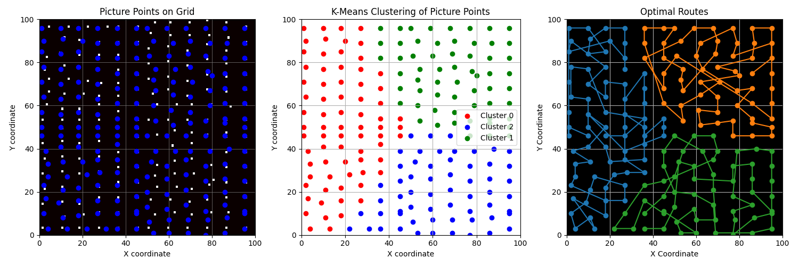

#### Picture Points Coordinates

The stage tackles the problem of selecting optimal points on a grid to take pictures such that every cell on the grid is covered by at least one picture point. The solution utilizes an Integer Linear Programming (ILP) approach to minimize the number of picture points required to cover the entire grid.

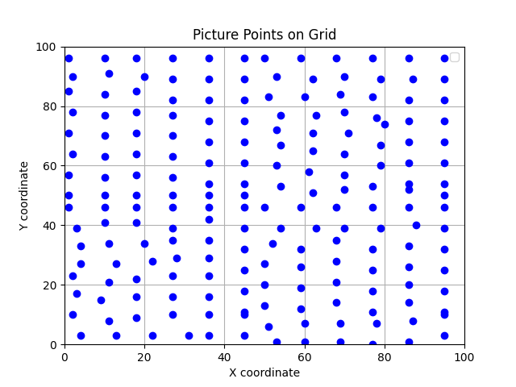

The code used to solve this problem can be found in _route_nav/PicturePoints.py_ and is as follows:

```python
from pulp import LpMinimize, LpProblem, LpVariable, lpSum, LpBinary

def ILP_picture_points_problem(partition):
    problem = LpProblem("Picture_Point_Selection", LpMinimize)
    points = {(i, j): LpVariable(f"p_{i}_{j}", cat=LpBinary)
              for i in range(partition[0], partition[2])
              for j in range(partition[1], partition[3])}

    # Objective: Minimize the number of picture points
    problem += lpSum(points.values())

    # Constraints: Cover all cells in the partition
    for i in range(partition[0], partition[2]):
        for j in range(partition[1], partition[3]):
            covered_by = []
            # Include cells within 4 cells distance in each direction
            for di in range(-3, 4):  # horizontal fov of dji mini
                for dj in range(-4, 5):  # vertical fov of dji mini
                    if (i + di, j + dj) in points:
                        covered_by.append(points[(i + di, j + dj)])

            # Ensure at least one point covers (i, j)
            problem += lpSum(covered_by) >= 1, f"Coverage_for_cell_{i}_{j}"

    problem.solve()
    return [(i, j) for (i, j), var in points.items() if var.value() == 1]

def generate_picture_points(grid_width, grid_height, partition_size=1):
    # Partitioning the grid (Variant 2)
    partitions = [(i, j, i + partition_size, j + partition_size)
                  for i in range(0, grid_height, partition_size)
                  for j in range(0, grid_width, partition_size)]
    picture_points = []
    for partition in partitions:
        picture_points.extend(ILP_picture_points_problem(partition))

    return picture_points
```

Our code solves this problem through the following steps:

1. Partitioning the Grid
   - The _generate_picture_points()_ function starts by partitioning the grid into smaller more managable sections, then solving the problem for each section.
   - This method introduces a little bit of redundancy in which a few picture points on the perimeters of each partition might have overlaps, however, it greatly increases the speed at which the algorithm is able to solve the problem.
   - The _ILP_picture_point_problem()_ function is called for each partition.
2. Problem Definition
   - The function creates an ILP problem named "Picture_Point_Selection" with the objective to minimize the number of selected picture points.
   - It defines binary decision variables p*{i}*{j} for each cell (i, j) in the partition, indicating whether a picture point is placed at that cell.
3. Defining the Objective
   - The objective function is to minimize the sum of the binary decision variables, effectively minimizing the number of picture points.
4. Defining the Constraints:
   - For each cell (i, j) in the partition, the function ensures that there is at least one picture point within a distance of 3 cells in in the x direction and 4 cells in the y direction. (inclusive).
   - 3 and 4 were used since we discovered that at an altitude of 35m we have the greatest balance of detection accuracy and field of view. Through experimentation we discovered that the width and height of the FOV at this altitude were 30m and 40m respectively.
   - For our simulation we are dividing all values by 10, and we also opted to assume that the drones detect a slightly smaller area. Although this introduces a bit of redundancy, we discovered that the object detection algorithm is slightly worse when the car is positioned at the very edge of the frame. This precautionary step should minimize that.
5. Solving the Problem
   - The function solves the ILP problem and returns the coordinates of the cells where picture points are placed.

#### Clustering of Picture Points

Once we have a list of picture point coordinates we use K-Means clustering to group the picture points into 3 distinct groups. Each cluster will be assigned to a drone, like this we make sure that the drones are all efficiently working and surveying the area simulateously, while also minimizing risks of drone collisions since each of the drones will be working in its own distinct area.

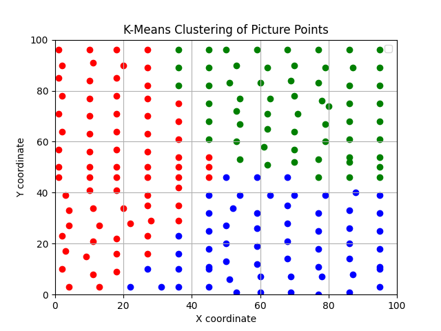

The code used to cluster these points can be found in _route_nav/Routing.py_ and is shown below:

```python
def cluster_picture_points(num_uavs, picture_points):
    kmeans = KMeans(n_clusters=num_uavs)
    kmeans.fit(picture_points)
    labels = kmeans.labels_

    return labels
```

The labels of each point are generated by making using of the K-Means algorithm from the scikit-learn library [18].

#### Optimal Route of each Cluster

The final step is to visit each picture point of a cluster minimizing the total route travelled, this is a classic instance of a TSP (Traveling Salesman Problem). In order to solve this version of the TSP we opted to use a genetic algorithm. The parameters of our genetic algorithm and how it works are discussed in detail later in the AI techniques section.

In the context of minimizing the total travel distance among a list of coordinates, a GA can efficiently search for a near-optimal solution to the TSP.

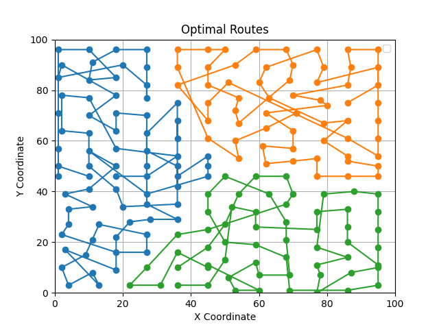

the code for this algorithm can be found in _route_nav/Routing.py_ and is shown below:

```python
def find_optimal_route(coordinates, population_size=100, generations=400, cxpb=0.7, mutpb=0.2, seed=42):
    """
    Find the optimal route through a list of xy coordinates using a genetic algorithm.

    Parameters:
    - coordinates: List of (x, y) tuples representing the coordinates.
    - population_size: Size of the population (default is 100).
    - generations: Number of generations (default is 400).
    - cxpb: Probability of crossover (default is 0.7).
    - mutpb: Probability of mutation (default is 0.2).
    - seed: Random seed for reproducibility (default is 42).

    Returns:
    - best_individual: The best route found as a list of indices.
    - best_route: The best route found as a list of coordinates.
    - best_distance: The total distance of the best route.
    """

    def distance(point1, point2):
        return np.sqrt((point1[0] - point2[0])**2 + (point1[1] - point2[1])**2)

    def eval_route(individual):
        total_distance = 0
        for i in range(len(individual)):
            total_distance += distance(coordinates[individual[i-1]], coordinates[individual[i]])
        return total_distance,

    toolbox = base.Toolbox()

    creator.create("FitnessMin", base.Fitness, weights=(-1.0,))
    creator.create("Individual", list, fitness=creator.FitnessMin)

    toolbox.register("indices", random.sample, range(len(coordinates)), len(coordinates))
    toolbox.register("individual", tools.initIterate, creator.Individual, toolbox.indices)
    toolbox.register("population", tools.initRepeat, list, toolbox.individual)

    toolbox.register("mate", tools.cxOrdered)
    toolbox.register("mutate", tools.mutShuffleIndexes, indpb=0.05)
    toolbox.register("select", tools.selTournament, tournsize=3)
    toolbox.register("evaluate", eval_route)

    random.seed(seed)

    population = toolbox.population(n=population_size)

    algorithms.eaSimple(population, toolbox, cxpb=cxpb, mutpb=mutpb, ngen=generations, verbose=False)

    best_individual = tools.selBest(population, k=1)[0]
    best_route = [coordinates[i] for i in best_individual]

    return best_route

def generate_optimal_routes(num_uavs, labels, picture_points):
    routes = []
    for label in range(num_uavs):
        cluster_points = [picture_points[idx] for idx, lab in zip(range(len(picture_points)), labels) if lab == label]
        if cluster_points:
            best_route = find_optimal_route(cluster_points)
            routes.append(best_route)

    return routes
```

The _generate_optimal_routes()_ performs the genetic algorithm on each cluster by calling the _find_optimal_route()_ function. The genetic algorithm is performed in the following steps:

1. Defining a Distance Calculation
   - A helper function _distance()_ is defined that computes the Euclidean distance between two points.
2. Route Evaluation function
   - The eval_route function is defined that calculates the total distance for a given route.
3. Genetic Algorithm Setup
   - A genetic algorithm toolbox is created using DEAP (Distributed Evolutionary Algorithms in Python) [19].
   - The fitness function is defined to minimize the total distance.
   - Individuals in the population represent routes as permutations of coordinate indices.
   - Genetic operations such as crossover, mutation, and selection are registered.
4. Population Initialization
   - A population of random routes is generated.
5. Evolution
   - The eaSimple algorithm is used to evolve the population over the specified number of generations.
6. Best Route Extraction
   - The best route is selected from the final population.

### Simulation

In order to simulate the drones moving around in a grid, we defined the Drone class within _route_nav/Drones.py_, the code is below:

```python
import numpy as np

BATTERY_LIFE = 2400  # 40 minutes in seconds

class Drone:
    def __init__(self, home, route=None):
        self.home = np.array(home)
        self.current_pos = np.array(home)
        self.in_flight = True
        self.battery_life = BATTERY_LIFE
        self.speed = 0.55  # speed in meters per second
        self.route = [np.array(point) for point in route] if route else []
        self.route_index = 0
        self.original_route = None  # Store original route if returning home
        self.original_index = 0
        self.safety_margin = 30
        self.returning_home = False  # Flag to indicate returning home

    def update_position(self, car_positions, detected_positions, detected_cars):
        if not self.in_flight:
            return  # Stops moving if landed

        self.battery_life -= 1
        if self.route_index < len(self.route):
            current_point = self.current_pos
            next_point = self.route[self.route_index]
            direction = next_point - current_point
            distance = np.linalg.norm(direction)

            if distance > 0:
                direction = direction / distance  # Normalize the direction vector

            travel_distance = min(self.speed, distance)
            self.current_pos = current_point + direction * travel_distance

            if np.linalg.norm(self.current_pos - next_point) < 1e-2:
                self.current_pos = next_point  # Snap to the waypoint to avoid floating-point issues
                self.detect_car(car_positions, detected_positions, detected_cars)
                self.route_index += 1
                if self.route_index == len(self.route):
                    if self.returning_home:
                        self.refuel()
                    else:
                        self.route_index = 0

        if not self.returning_home and self.calculate_return_home_battery() + self.safety_margin > self.battery_life:
            self.return_to_home()

    def detect_car(self, car_positions, detected_positions, detected_cars):
        for car_pos in car_positions:
            if abs(self.current_pos[0] - car_pos[0]) <= 4 and abs(self.current_pos[1] - car_pos[1]) <= 5:
                if car_pos not in detected_cars:
                    detected_cars.append(car_pos)  # Add detected car position to the list
                    detected_positions.append(self.current_pos.copy())  # Add drone position to the list

    def calculate_return_home_battery(self):
        home_distance = np.linalg.norm(self.home - self.current_pos)
        return home_distance / self.speed  # Time in seconds to return home

    def return_to_home(self):
        self.original_route = self.route  # Save the original route
        self.route = [self.home]  # Set route to only include home
        self.original_index = self.route_index
        self.route_index = 0
        self.returning_home = True

    def refuel(self):
        print("Refueling...")
        self.battery_life = BATTERY_LIFE  # Reset battery life
        self.route = self.original_route if self.original_route else [self.home]
        self.route_index = self.original_index
        self.returning_home = False
        self.in_flight = True

    def start_mission(self):
        self.in_flight = True

    def get_position(self):
        return self.current_pos.tolist()  # Convert numpy array to list for consistency

    def reset(self):
        self.current_pos = self.home
        self.route_index = 0
        self.battery_life = BATTERY_LIFE
        self.returning_home = False
        self.original_route = None
        self.original_index = 0
```

The Drone's speed, battery life and detection range are all based off of real world values, simply divided by 10.
The simulation is found within the _route_nav/simulation.py_ file and is ran using the 2 functions shown below:

```python
import numpy as np
import matplotlib.pyplot as plt
from matplotlib.animation import FuncAnimation
import random
import sys
from Drones import Drone
from PicturePoints import generate_picture_points
from Routing import cluster_picture_points, generate_optimal_routes

def update_plot(frame, drones, car_positions, detected_cars, detected_positions, scat_drones, scat_cars, scat_detected_cars, scat_detection_positions):
    print(f"Frame {frame}: Updating positions...")
    drone_positions = [drone.get_position() for drone in drones]
    scat_drones.set_offsets(drone_positions)

    scat_cars.set_offsets(car_positions)

    for drone in drones:
        drone.update_position(car_positions, detected_positions, detected_cars)
        print(f"Drone at {drone.get_position()} with battery {drone.battery_life}")

    # Update scatter plots for detected cars and detection positions
    if detected_cars:
        scat_detected_cars.set_offsets(detected_cars)
    if detected_positions:
        scat_detection_positions.set_offsets(detected_positions)

    if len(detected_cars) == len(car_positions):
        print("All cars detected. Stopping the simulation.")
        sys.exit()

    return scat_drones, scat_cars, scat_detected_cars, scat_detection_positions

def simulate_drones_visual(drones, car_positions, detected_cars, detected_positions, grid_width, grid_height):
    fig, ax = plt.subplots()
    # Setting the limits of the plot
    ax.set_xlim(0, grid_width)
    ax.set_ylim(0, grid_height)

    # Plotting drones and cars
    drone_positions = [drone.get_position() for drone in drones]
    if drone_positions:
        scat_drones = ax.scatter(*zip(*drone_positions), c='blue', label='Drones')
    else:
        scat_drones = ax.scatter([], [], c='blue', label='Drones')

    if car_positions:
        scat_cars = ax.scatter(*zip(*car_positions), c='red', label='Cars')
    else:
        scat_cars = ax.scatter([], [], c='red', label='Cars')

    # Initialize empty scatter plots for detected cars and detection positions
    scat_detected_cars = ax.scatter([], [], c='green', label='Detected Cars')
    scat_detection_positions = ax.scatter([], [], c='black', label='Detection Positions')

    animation = FuncAnimation(fig, update_plot,
                              fargs=(drones, car_positions, detected_cars, detected_positions, scat_drones, scat_cars, scat_detected_cars, scat_detection_positions),
                              frames=None, interval=10, repeat=True)

    plt.legend()
    plt.show()
    return animation

if __name__ == "__main__":
    NUM_UAVS = 3
    width, height = 100, 100
    PARTITION_SIZE = 50
    home_pos = (50, 0)
    num_cars = 10

    picture_points = generate_picture_points(width, height, PARTITION_SIZE)
    picture_points = np.array(picture_points)

    point_labels = cluster_picture_points(NUM_UAVS, picture_points)
    routes = generate_optimal_routes(NUM_UAVS, point_labels, picture_points)

    drones = [Drone(home_pos, route) for route in routes]
    car_positions = [(random.uniform(0, width), random.uniform(0, height)) for _ in range(num_cars)]
    detected_car_positions = []
    detected_positions = []

    simulate_drones_visual(drones, car_positions, detected_car_positions, detected_positions, width, height)
```

The simulation, works as follows:

1. Generate optimum routes for each drone using the seps outlined previously.
2. 10 cars are placed at random positions throughout the grid.
3. Make the 3 drones take off and start the simulation.
4. Update the position of each drone every second by calculating its new position using vectors based on the next picture point and the drones speed.
5. Check that the drone has enough battery to continue surveying the area. If the drone doesnt have enough fuel to return to home, land and still have a little left over as a safety margin, it will stop following its route and return to home. After refuelling it continues along it's original route.
6. At each picture point the drone simulates taking a picture and running it through the object detection algorithm.
7. Once all the cars have been found the simulation stops.

The following is a link to a youtube video of the simulation running at 10x speed:

https://youtu.be/ROnoFJae1ws

### Object Detection

To detect cars in images we created the _detect.py_ script found inside the _obj_ directory. This script uses pyTorch and our custom trained model to detect cars in images supplied to it.

```python
import torch
import cv2
from pathlib import Path

def load_model(weights_path):
    model = torch.hub.load('yolov5', 'custom', path=weights_path, source='local')
    return model

def detect_car(image_path, model):
    img = cv2.imread(str(image_path))

    results = model(img)

    detections = results.pred[0]

    for det in detections:
        class_id = int(det[5])
        if class_id == 0:
            return True
    return False

if __name__ == '__main__':
    # Path to the weights file
    weights_path = Path('yolov5/runs/train/car_detection_drone/weights/best.pt')

    # Directory containing the images
    image_dir = Path('new_images/')

    # Load the model once
    model = load_model(weights_path)

    # Iterate through all images in the directory
    for image_path in image_dir.glob('*.JPG'):
        if detect_car(image_path, model):
            print(f"Car detected in image: {image_path}")
        else:
            print(f"No car detected in image: {image_path}")
```

We developed the _detect_car()_ function that will return true if a car is detected in the image supplied and false otherwise. In theory, at each picture point the drones will take a photo and that photo will be passed through this function.

## AI Techniques

### UAV Route Optimization

In our project, we optimized drone movement and routing by using cutting-edge AI techniques. The main techniques used were k-means clustering and genetic algorithms, both of which were essential in guaranteeing that the UAVs covered the target areas effectively and efficiently.

#### K-Means Clustering of Picture Points

The image points were divided into separate clusters using K-means clustering. By designating a single UAV to each cluster, the workload could be divided equally among the UAVs. This technique optimized the scanning process by guaranteeing that every UAV operated within a predetermined area.

By applying k-means clustering, we were able to:

1. Divide the overall task into manageable segments.
2. Ensure balanced coverage by assigning specific clusters to individual UAVs.
3. Simplify the route planning process for each UAV by limiting their operational area.

The k-means algorithm effectively grouped the picture points based on their spatial distribution. This clustering facilitated efficient planning and execution of the UAVs' routes. The number of UAVs and clusters was set to 3 as that is what we were tasked with.

#### Genetic Algroithm for Route Optimization

After forming the clusters, we optimized the path for each UAV within its designated cluster. We used a genetic algorithm to address this optimization problem. Genetic algorithms are particularly well-suited for solving complex routing problems, such as the Traveling Salesman Problem (TSP), where the goal is to minimize the total travel distance.

The genetic algorithm in our project:

1. Evaluated potential routes based on the total distance traveled.
2. Iteratively improved the routes through selection, crossover, and mutation processes.
3. Converged on an optimal or near-optimal route for each UAV within its cluster.

For the genetic algorithm, a population size of 100 was used, to allow for a diverse set of potential solutions. The crossover probability was set to 0.7, which allows for effective exploration of new routes. As for the mutation probability, 0.2 was used and the number of generations was set to 400.

The use of a genetic algorithm ensures that each UAV took an acceptably optimal route through its designated cluster, which reduced both travel time and energy usage. Using the principles of evolution, the algorithm explored many potential paths and improved them over a series of generations.

### Object Detection

#### Yolov5m and Model Training

For the object detection section of our project, we used YOLOv5. YOLO, which stands for "You Only Look Once," processes images in a single pass, allowing for faster processing since it does not require multiple independent evaluations [20].

Although YOLO is fast, it struggles with detecting small targets. YOLOv5 addresses this shortcoming by enhancing the training data through the data loader. It employs an anchor mechanism like that of Faster R-CNN, which improves its ability to detect small objects [21].

Therefore, we chose YOLOv5 for our project due to its effectiveness in detecting small objects. Since our project involves drones flying in the air and scanning the ground below, the height of the drone could not be a limiting factor, making YOLOv5 a suitable choice.

As previously mentioned, we used the online dataset [1] for our project, which contains 773 overhead images of cars. We trained yolov5m on this dataset. Additionally, on top of using the test set of the data set, we used images taken by the drone itself to test the model in real-life scenarios.

#### Data Augmentation on the Data Set

Data augmentation is an AI technique that involves increasing the volume, quality, and diversity of training data. Popular general techniques involve geometric transformations, colour space transformations, and image mixing [22].

The dataset we found online and opted to use had already implemented a number of these techniques [1]. Geometric transformations included horizontal and vertical flipping, 90° clockwise and counter-clockwise rotations, and rotations between -5° and 5°. Colour space transformations included converting 10% of images to grayscale, adjusting the hue between -25° and +25°, altering the saturation between -25% and +25%, modifying the brightness between -25% and +25%, and changing the exposure between -25% and +25%. Additionally, a slight blur of up to 1 pixel was applied to some images to further enhance the robustness of the model.

## Evaluation

### Method/Process

Below is a list of the sections of our project that were evaluated and the metrics used to evaluate them:

1. Picture Point Generation (ILP)
   - Total Coverage Percentage
   - Compute Time
   - Redundancy/Overlap
2. K-Means Clustering of Picture Points
   - Silhouette Score
   - Davies-Boulin index
   - Balance
   - Compute Time
3. Genetic Algroithm (Per Cluster)
   - Compute Time
   - Best Distance
   - Convergence Plots
4. Simulation
   - Average time for all cars to be detected (10000 runs)
5. Object Detection
   - Confusion Matrix
   - Precision Value
   - Recall Value
   - F1-Score
   - Precision Recall Curve
   - Mean Average Precision at IoU threshold 0.50
   - Mean Average Precision averaged over IoU thresholds from 0.50 to 0.95
   - Real life examples

The code used for steps 1-4 can be found in _route_nav/testing.py_ and is shown below:

```python
import time
from sklearn.cluster import KMeans
from sklearn.metrics import silhouette_score, davies_bouldin_score
from collections import Counter
import random
from deap import base, creator, tools, algorithms
import matplotlib.pyplot as plt
import numpy as np
from PicturePoints import generate_picture_points
from Drones import Drone

def evaluate_pic_points(grid_width, grid_height, partition_size=1):
    start_time = time.time()
    picture_points = generate_picture_points(grid_width, grid_height, partition_size)
    end_time = time.time()

    coverage = [[0 for _ in range(grid_width)] for _ in range(grid_height)]

    for (i, j) in picture_points:
        for di in range(-3, 4):
            for dj in range(-4, 5):
                ni, nj = i + di, j + dj
                if 0 <= ni < grid_height and 0 <= nj < grid_width:
                    coverage[ni][nj] += 1

    total_cells = grid_width * grid_height
    covered_cells = sum(1 for row in coverage for cell in row if cell > 0)
    redundant_coverage = sum(cell - 1 for row in coverage for cell in row if cell > 1)

    coverage_percentage = covered_cells / total_cells * 100
    redundancy_percentage = redundant_coverage / total_cells * 100
    time_taken = end_time - start_time

    print(f"Coverage Percentage: {coverage_percentage:.2f}%")
    print(f"Redundancy Percentage: {redundancy_percentage:.2f}%")
    print(f"Time Taken: {time_taken:.2f} seconds")

    return {
        "coverage_percentage": coverage_percentage,
        "redundancy_percentage": redundancy_percentage,
        "time_taken": time_taken,
        "picture_points": picture_points
    }

def evaluate_clustering(num_uavs, picture_points):
    kmeans = KMeans(n_clusters=num_uavs, random_state=42)
    start_time = time.time()
    kmeans.fit(picture_points)
    end_time = time.time()

    labels = kmeans.labels_
    silhouette_avg = silhouette_score(picture_points, labels)
    davies_bouldin = davies_bouldin_score(picture_points, labels)

    # Balance metric: calculate the distribution of points in clusters
    label_counts = Counter(labels)
    balance = np.std(list(label_counts.values())) / np.mean(list(label_counts.values()))

    clustering_time = end_time - start_time

    print(f"Silhouette Score: {silhouette_avg:.2f}")
    print(f"Davies-Bouldin Index: {davies_bouldin:.2f}")
    print(f"Balance: {balance:.2f}")
    print(f"Clustering Time: {clustering_time:.2f} seconds")

    return {
        "silhouette_score": silhouette_avg,
        "davies_bouldin_index": davies_bouldin,
        "balance": balance,
        "clustering_time": clustering_time,
        "labels": labels
    }

def evaluate_genetic_algorithm(coordinates, label, population_size=100, generations=400, cxpb=0.7, mutpb=0.2, seed=42):
    """
    Evaluate the performance of a genetic algorithm in finding the optimal route through a list of xy coordinates.

    Parameters:
    - coordinates: List of (x, y) tuples representing the coordinates.
    - population_size: Size of the population (default is 100).
    - generations: Number of generations (default is 400).
    - cxpb: Probability of crossover (default is 0.7).
    - mutpb: Probability of mutation (default is 0.2).
    - seed: Random seed for reproducibility (default is 42).

    Returns:
    - evaluation_results: A dictionary containing evaluation metrics and other relevant information.
    """

    def distance(point1, point2):
        return np.sqrt((point1[0] - point2[0])**2 + (point1[1] - point2[1])**2)

    def eval_route(individual):
        total_distance = 0
        for i in range(len(individual)):
            total_distance += distance(coordinates[individual[i-1]], coordinates[individual[i]])
        return total_distance,

    # Setup genetic algorithm
    toolbox = base.Toolbox()
    creator.create("FitnessMin", base.Fitness, weights=(-1.0,))
    creator.create("Individual", list, fitness=creator.FitnessMin)

    toolbox.register("indices", random.sample, range(len(coordinates)), len(coordinates))
    toolbox.register("individual", tools.initIterate, creator.Individual, toolbox.indices)
    toolbox.register("population", tools.initRepeat, list, toolbox.individual)

    toolbox.register("mate", tools.cxOrdered)
    toolbox.register("mutate", tools.mutShuffleIndexes, indpb=0.05)
    toolbox.register("select", tools.selTournament, tournsize=3)
    toolbox.register("evaluate", eval_route)

    random.seed(seed)
    population = toolbox.population(n=population_size)

    # Run genetic algorithm and track best distances
    best_distances = []
    start_time = time.time()

    for gen in range(generations):
        population = algorithms.varAnd(population, toolbox, cxpb=cxpb, mutpb=mutpb)
        fits = toolbox.map(toolbox.evaluate, population)
        for fit, ind in zip(fits, population):
            ind.fitness.values = fit
        population = toolbox.select(population, k=len(population))

        best_individual = tools.selBest(population, k=1)[0]
        best_distance = eval_route(best_individual)[0]
        best_distances.append(best_distance)

    end_time = time.time()
    total_time = end_time - start_time

    best_individual = tools.selBest(population, k=1)[0]
    best_distance = eval_route(best_individual)[0]
    best_route = [coordinates[i] for i in best_individual]

    # Plotting the convergence
    plt.figure(figsize=(10, 6))
    plt.plot(best_distances, label='Best Distance per Generation')
    plt.xlabel('Generation')
    plt.ylabel('Distance')
    plt.title('Genetic Algorithm Convergence')
    plt.legend()
    plt.grid(True)
    plt.savefig(f'results/GA_convergence_{label}.png')

    print(f"Best Distance: {best_distance}")
    print(f"Time Taken: {total_time} seconds")

    # Return evaluation results
    evaluation_results = {
        "best_individual": best_individual,
        "best_route": best_route,
        "best_distance": best_distance,
        "total_time": total_time,
        "best_distances": best_distances
    }

    return evaluation_results

def simulate_drones(drones, car_positions, detected_cars, detected_positions):
    frame = 0
    while True:
        for drone in drones:
            drone.update_position(car_positions, detected_positions, detected_cars)

        if len(detected_cars) == len(car_positions):
            break

        frame += 1

    return frame

if __name__ == "__main__":
    # simulation variables
    width, height = 100, 100
    PARTITION_SIZE = 50
    home_pos = (50, 0)
    num_uavs = 3
    num_cars = 10

    # picture points testing
    results = evaluate_pic_points(grid_width=width, grid_height=height, partition_size=PARTITION_SIZE)
    picture_points = results["picture_points"]

    # clustering testing
    clustering_results = evaluate_clustering(num_uavs, picture_points)
    labels = clustering_results["labels"]

    # GA testing
    GA_results = []
    for label in range(num_uavs):
        cluster_points = [picture_points[idx] for idx, lab in zip(range(len(picture_points)),
                                                                  labels) if lab == label]
        if cluster_points:
            best_route = evaluate_genetic_algorithm(cluster_points, label)
            GA_results.append(best_route)

    routes = [result["best_route"] for result in GA_results]

    # sim testing
    drones = [Drone(home_pos, route) for route in routes]
    simulation_times = []
    for index in range(10000):
        car_positions = [(random.uniform(0, width), random.uniform(0, height)) for _ in range(num_cars)]
        detected_car_positions = []
        detected_positions = []
        frame = simulate_drones(drones, car_positions, detected_car_positions, detected_positions)
        simulation_times.append(frame)
        print(f"Simulation {index + 1} took {frame:.2f} seconds")

    simulation_times_np = np.array(simulation_times)
    mean_time = np.mean(simulation_times_np)
    median_time = np.median(simulation_times_np)
    std_time = np.std(simulation_times_np)
    min_time = np.min(simulation_times_np)
    max_time = np.max(simulation_times_np)

    print(f"\nMean time: {mean_time:.2f} seconds")
    print(f"Median time: {median_time:.2f} seconds")
    print(f"Standard Deviation: {std_time:.2f} seconds")
    print(f"Min time: {min_time:.2f} seconds")
    print(f"Max time: {max_time:.2f} seconds")

    print(f"\nILP Picture Points Problem Results:")
    print(f"Coverage Percentage: {results['coverage_percentage']:.2f}%")
    print(f"Redundancy Percentage: {results['redundancy_percentage']:.2f}%")
    print(f"Time Taken: {results['time_taken']:.2f} seconds")

    print(f"\nClustering Results:")
    print(f"Silhouette Score: {clustering_results['silhouette_score']:.2f}")
    print(f"Davies-Bouldin Index: {clustering_results['davies_bouldin_index']:.2f}")
    print(f"Balance: {clustering_results['balance']:.2f}")
    print(f"Clustering Time: {clustering_results['clustering_time']:.2f} seconds")

    print(f"\nGenetic Algorithm Results:")
    for idx, result in enumerate(GA_results):
        print(f"Cluster {idx} - Best Distance: {result['best_distance']:.2f} - Time Taken: {result['total_time']:.2f} seconds")


    # Plotting boxplot
    plt.figure(figsize=(10, 6))
    plt.boxplot(simulation_times, vert=False, patch_artist=True,
                boxprops=dict(facecolor='lightblue', color='blue'),
                medianprops=dict(color='red'))

    plt.title('Boxplot of Simulation Times')
    plt.ylabel('Simulations')
    plt.xlabel('Time (seconds)')
    plt.savefig('results/boxplot_simulation_times.png')
    plt.show()
```

However, the object detection algorithm can be tested by running the following commands in the terminal.

```bash
test dataset:
python val.py --data dataset/data.yaml --weights runs/train/car_detection_drone/weights/best.pt --img 640

detect_cars from new_images:
- upload to new_images
python detect.py --weights runs/train/car_detection_drone/weights/best.pt --img 640 --conf 0.25 --source ../new_images
```

_N.B. images with cars to be detected must be placed within the obj/new_images directory_

### Results

Below are the results for each metric discussed in the preious section:

#### Picture Point Generation (ILP)

- Total Coverage -> 100.00%
- Redundancy/Overlap -> 17.87%
- Compute Time -> 8.08 seconds

These results are acceptable. 100% total coverage was required in order to dtate we surveyed the whole area, while a redundacy of 18% of the area is quite high but a necessary trade off for better computation time and better object detection recall.

#### K-Means Clustering of Picture Points

- Silhouette Score -> 0.36
- Davies-Boulin index -> 0.88
- Balance -> 0.03
- Compute Time -> 0.24 seconds

The Silhouette Score measures how similar an object is to its own cluster compared to other clusters. It ranges from -1 to 1, where a higher score indicates better-defined clusters.  
A score of 0.36 suggests that the clusters are moderately well-defined, but there is room for improvement. While the clusters are not random, they are not perfectly separated either, indicating that some data points may be ambiguously assigned to clusters.

The Davies-Bouldin Index measures the average similarity ratio of each cluster with its most similar cluster. Lower values indicate better clustering, with values close to 0 indicating compact and well-separated clusters.  
A Davies-Bouldin Index of 0.88 suggests that the clusters are reasonably compact and well-separated, but there may be some overlap or clustering that could be improved.

Balance typically refers to how evenly distributed the points are among the clusters. A balance of 1 means all clusters have the same number of points, while lower values indicate more imbalance.  
A balance of 0.03 indicates a high degree of imbalance, meaning that some clusters have significantly more points than others. This could affect the overall performance and applicability of the clustering for tasks requiring even distribution.

These can also be viewed visually in the cluster plot below:


#### Genetic Algroithm

- Cluster 1
  - Compute Time -> 2.70 seconds
  - Best Distance -> 6057.40m
    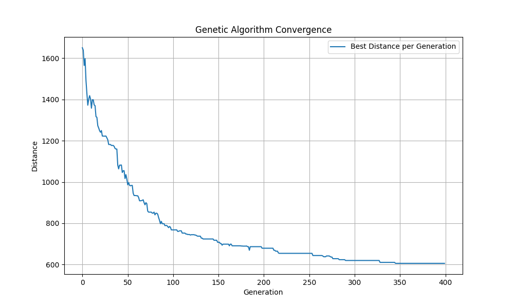
- Cluster 2
  - Compute Time -> 2.87 seconds
  - Best Distance -> 7479.50m
    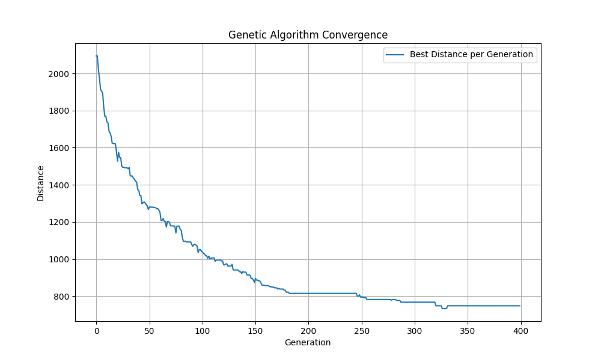
- Cluster 3
  - Compute Time -> 2.64 seconds
  - Best Distance -> 6144.8m
    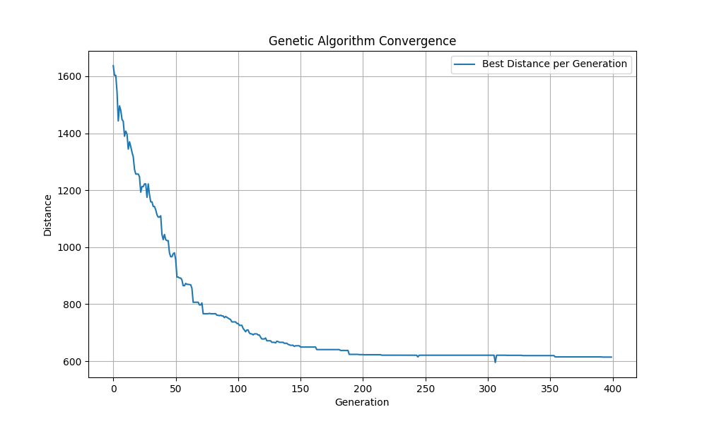

From the above results we observe that using a genetic algorithm for this problem was indeed an effective solution.

#### Simulation

- Mean time -> 1275.95 seconds
- Median time -> 1276.00 seconds
- Standard Deviation -> 226.14 seconds
- Min time -> 424.00 seconds
- Max time -> 1702.00 seconds

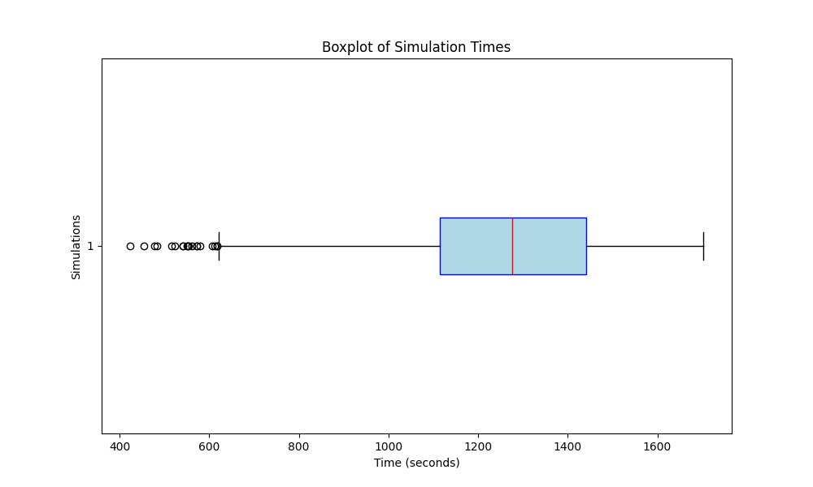

#### Object Detection

- Confusion Matrix
  
- Precision: 0.882
  
- Recall: 0.923
  
- F1-Score: 0.902
  
- Precision Recall Curve
  
- mAP@50: 0.933
- mAP@50-95: 0.672

These results suggest that the object detection algorithm performs well with high precision and recall, resulting in a balanced F1-Score. The mAP values indicate strong performance, especially at the 0.50 IoU threshold, however, indicating some room for improvement at higher IoU thresholds.

#### Real Life Examples

Below are some of the images taken using the drones, and the results of passing them through our object detection model. This is a subset of the images used to decide which height to fly the drone at in our simulation.

_Images taken at a height of 30m_


_Images taken at a height of 40m_
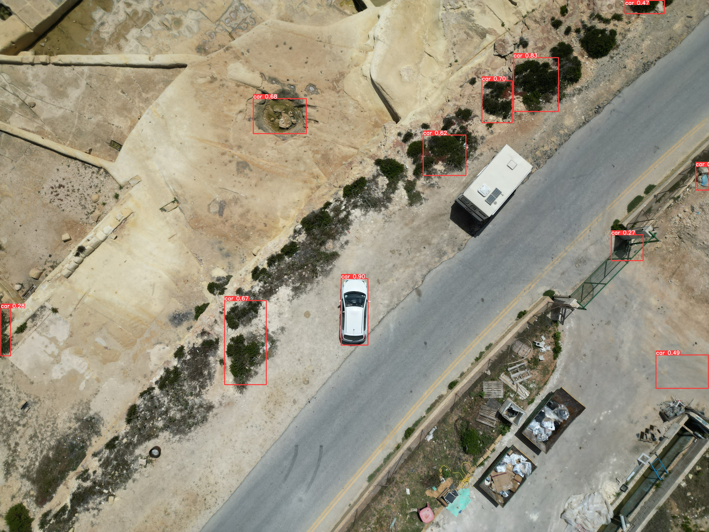


As can be seen in the above images, the model performs decently at an altitude of 30-40m. However, performance is not perfect.

## Conclusion

Our project successfully demonstrated the use of autonomous drone systems for area surveillance and monitoring, focusing on search and rescue missions. By leveraging three DJI Mini 3 drones, we implemented advanced AI techniques for pathfinding, route optimization, and object detection to locate stationary vehicles in large areas. The integration of genetic algorithms and k-means clustering ensured efficient coverage and minimized the overall surveying time.

This project shows a proof of concept for drone-based surveillance and monitoring. Future expansions could include extending the object detection capabilities to identify and track moving objects using algorithms like Deep SORT and other tracking techniques, enhancing the system's ability to follow and monitor dynamic targets, improving its applicability in real-time scenarios.  
The project can also be expanded by setting up a realtime interface using the mobile SDK if DJI mini 3 are the drone of choice, or alternatively changing drones and using the simpler Windows SDK.  
Finally, the last improvement we suggest is to train the object detection model to detect more than just cars from aerial images.

In conclusion, this project has demonstrated the feasibility and potential of using autonomous drones for efficient and effective area surveillance and monitoring in search and rescue missions. The results obtained provide a solid basis for future research and development, aiming to enhance the capabilities and applications of UAV systems in various fields.

## References

[1] C. D. O. View, ‘Cars - Overhead View Dataset’, Roboflow Universe. Roboflow, Oct-2022.

[2] A. Ryan, M. Zennaro, A. Howell, R. Sengupta, J. Hedrick, An overview of emerging results in cooperative UAV control, in: Proc. IEEE Conf. Decision and Control, 1, 2004, pp. 602–607, doi:10.1109/CDC.2004.1428700.

[3] M. Kovacina, D. Palmer, G. Yang, R. Vaidyanathan, Multi-agent control algorithms for chemical cloud detection and mapping using unmanned air vehicles, in: Proc. IEEE/RSJ Intl. Conf. on Intelligent Robots and Systems, 3, 2002, pp. 2782–2788.

[4] R.C. Palat, A. Annamalai, J.H. Reed, Cooperative relaying for ad hoc ground networks using swarms, in: Proc. IEEE Milit. Comm. Conf. (MILCOM’05), 3, 2005, pp. 1588–1594.

[5] D. Cole, A. Goktogan, P. Thompson, S. Sukkarieh, Mapping and tracking, IEEE Robotics Automation Magazine 16 (2) (2009) 22–34.

[6] Q. Lindsey, D. Mellinger, V. Kumar, Construction of cubic structures with quadrotor teams, in: Proc. of Robotics: Science and Systems, Los Angeles, CA, USA, 2011.

[7] S. Hayat, E. Yanmaz, R. Muzaffar, Survey on unmanned aerial vehicle networks for civil applications: a communications viewpoint, IEEE Communications Surveys Tutorials 18 (4) (2016) 2624–2661.

[8] M. Erdelj, E. Natalizio, K.R. Chowdhury, I.F. Akyildiz, Help from the sky: leveraging UAVs for disaster management, IEEE Pervasive Comput. 16 (1) (2017)
24–32.

[9] E. Yanmaz, S. Yahyanejad, B. Rinner, H. Hellwagner, and C. Bettstetter, ‘Drone networks: Communications, coordination, and sensing’, Ad Hoc Networks, vol. 68, pp. 1–15, 2018.

[10] S. Li, X. Yang, X. Lin, Y. Zhang, and J. Wu, ‘Real-Time Vehicle Detection from UAV Aerial Images Based on Improved YOLOv5’, Sensors, vol. 23, no. 12, 2023.

[11] A. Price, J. Pyke, D. Ashiri, and T. Cornall, ‘Real time object detection for an unmanned aerial vehicle using an FPGA based vision system’, in Proceedings 2006 IEEE International Conference on Robotics and Automation, 2006. ICRA 2006., 2006, pp. 2854–2859.

[12] H. Tayara, K. Gil Soo, and K. T. Chong, ‘Vehicle Detection and Counting in High-Resolution Aerial Images Using Convolutional Regression Neural Network’, IEEE Access, vol. 6, pp. 2220–2230, 2018.

[13] M. Quaritsch, K. Kruggl, D. Wischounig-Strucl, S. Bhattacharya, M. Shah, and B. Rinner, ‘Networked UAVs as aerial sensor network for disaster management applications’, e & i Elektrotechnik und Informationstechnik, vol. 127, no. 3, pp. 56–63, Mar. 2010.

[14] E. Yanmaz, R. Kuschnig, M. Quaritsch, C. Bettstetter, and B. Rinner, ‘On path planning strategies for networked unmanned aerial vehicles’, in 2011 IEEE Conference on Computer Communications Workshops (INFOCOM WKSHPS), 2011, pp. 212–216.

[15] “DJI Mobile SDK,” developer.dji.com. https://developer.dji.com/doc/mobile-sdk-tutorial/en/ (accessed March 20, 2024).

[16] “DJI Mini 3 - Specs - DJI,” DJI Official. https://www.dji.com/mt/mini-3/specs (accessed May 14th, 2024).
‌
[17] G. Jocher, “ultralytics/yolov5,” GitHub, Aug. 21, 2020. https://github.com/ultralytics/yolov5

[18] “2.3. Clustering — scikit-learn 0.20.3 documentation,” Scikit-learn.org, 2010. https://scikit-learn.org/stable/modules/clustering.html

[19] “DEAP documentation — DEAP 1.3.0 documentation,” Readthedocs.io, 2019. https://deap.readthedocs.io/en/master/
‌
[20] J.-H. Kim, N. Kim, Y. W. Park, and C. S. Won, ‘Object Detection and Classification Based on YOLO-V5 with Improved Maritime Dataset’, Journal of Marine Science and Engineering, vol. 10, no. 3, 2022.

[21] W. Wu et al., ‘Application of local fully Convolutional Neural Network combined with YOLO v5 algorithm in small target detection of remote sensing image’, PLOS ONE, vol. 16, no. 10, pp. 1–15, 10 2021.

[22] A. Mumuni and F. Mumuni, ‘Data augmentation: A comprehensive survey of modern approaches’, Array, vol. 16, p. 100258, 2022.
